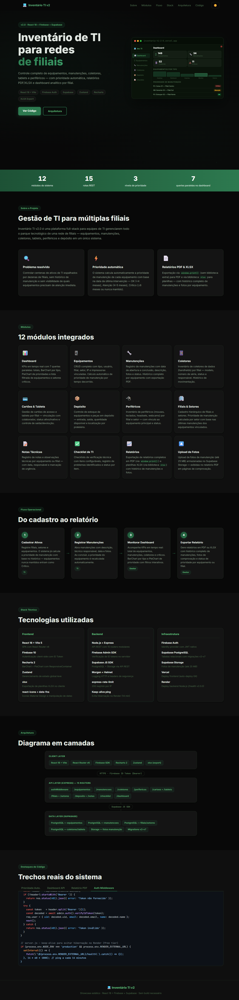

<div align="center">

# 🖥 Inventário TI v2.0 — Showcase

**Centraliza a operação completa do time de T.I**  
Equipamentos, manutenções, coletores, prioridade automática por tempo sem manutenção e relatórios PDF para a gestão.

<br/>


</div>

---

## 💼 Visão de Negócio

> **Problema** — Equipe de T.I sem visibilidade sobre o patrimônio: equipamentos espalhados entre filiais, sem histórico de manutenção, sem alerta de criticidade, dependência de planilhas e controle manual de quem usou o quê.
>
> **Solução** — Sistema centralizado com 12 módulos cobrindo todo o ciclo: cadastro de equipamentos, registro de manutenções, gestão de coletores, vínculo com colaboradores e filiais, prioridade automática calculada pelo tempo desde a última manutenção (OK / Atenção / Crítico), histórico por equipamento e exportação em PDF.
>
> **Resultado** — Equipe de T.I com um único ponto de verdade sobre patrimônio e manutenções; dashboard com KPIs por filial, gráficos por tipo e lista priorizada por urgência de manutenção.

| | |
|---|---|
| **Contexto** | Comercial Maranguape — operação interna de T.I |
| **Usuários** | Equipe de T.I |
| **Substitui** | Planilhas + controle manual |
| **Status** | Em uso pela equipe |

---

## 📸 Preview



## 🎯 Sobre Este Repositório

Este repositório contém **apenas o site de apresentação** (showcase) do Inventário TI v2.0. O código-fonte original do sistema (backend + frontend React) não está incluído — este projeto serve como vitrine pública explicando a arquitetura, módulos, decisões técnicas e funcionamento do sistema.

### O que o showcase apresenta

| Seção | Conteúdo |
|---|---|
| **Hero** | Apresentação animada com mockup interativo do dashboard verde-escuro |
| **Sobre** | Problema resolvido, prioridade automática, exportação PDF |
| **Módulos** | 12 módulos: Equipamentos, Dashboard, Manutenções, Coletores, Colaboradores, Filiais, Relatórios, Histórico, Alertas, Auth, Perfil, Logs |
| **Fluxo Operacional** | Ciclo: Cadastrar → Monitorar → Manter → Exportar |
| **Stack Técnica** | Frontend React, Backend Express e Infraestrutura com descrições técnicas |
| **Arquitetura** | Diagrama em 3 camadas: Client → Express API (15 rotas) → Supabase |
| **Destaques de Código** | 4 snippets reais: calcularPrioridade, Dashboard API (7 queries), Relatório PDF, Auth Middleware |

---

## 🚀 Como Rodar

**Sem nenhuma dependência ou instalação.** Basta abrir o arquivo:

```bash
# Opção 1 — abrir direto no navegador
index.html  →  duplo clique ou arrastar para o browser

# Opção 2 — servidor local simples (recomendado para evitar CORS)
npx serve .
# ou
python -m http.server 8080
# ou
npx live-server
```

> Requer conexão com internet para carregar as CDNs (GSAP, highlight.js, Google Fonts).

---

## 🗂️ Estrutura do Projeto

```
Inventario de t.i/
├── index.html       # Estrutura HTML completa — todas as seções
├── style.css        # Estilos, tema escuro sage-green, responsividade
├── main.js          # Todas as animações GSAP + interatividade
└── README.md        # Este arquivo
```

**Zero dependências de build.** Nenhum `package.json`, `node_modules` ou passo de compilação.

---

## ⚙️ Tecnologias do Showcase

| Tecnologia | Versão | Uso |
|---|---|---|
| **GSAP 3** | 3.12.5 | Animações de entrada, stagger, ScrollTrigger, timeline do hero |
| **ScrollTrigger** | plugin GSAP | Revelação de seções ao rolar |
| **highlight.js** | 11.9.0 | Syntax highlighting nos snippets de código |
| **Google Fonts** | — | Inter (texto) + JetBrains Mono (código) |
| **HTML5 / CSS3** | — | Variáveis CSS, grid, flexbox, dark/light mode via `data-theme` |
| **Vanilla JS** | ES2020+ | Tabs, scroll, tema, eventos |

### Como o GSAP é utilizado

```javascript
// 1. Timeline sequencial no hero (entrada ao carregar a página)
const tl = gsap.timeline({ defaults: { ease: 'power3.out' } });
tl
  .fromTo('#heroBadge',  { opacity: 0, y: -14 }, { opacity: 1, y: 0, duration: 0.45 })
  .fromTo('.hero-title', { opacity: 0, y: 28  }, { opacity: 1, y: 0, duration: 0.55 }, '-=0.20')
  .fromTo('#heroMockup', { opacity: 0, x: 36  }, { opacity: 1, x: 0, duration: 0.70 }, '-=0.40');

// 2. ScrollTrigger — revela seções ao entrar na viewport
ScrollTrigger.create({
  trigger: el, start: 'top 88%', once: true,
  onEnter: () => gsap.fromTo(el,
    { opacity: 0, y: 34, scale: 0.96 },
    { opacity: 1, y: 0,  scale: 1, duration: 0.65, ease: 'power3.out' }
  ),
});

// 3. Stagger em arch-boxes — cada box entra com delay acumulado
gsap.fromTo('.arch-box',
  { opacity: 0, scale: 0.85 },
  { opacity: 1, scale: 1, stagger: 0.07, duration: 0.40, ease: 'back.out(1.4)' }
);
```

> **Nota técnica:** todos os tweens usam `fromTo()` (não `from()`) porque os elementos começam com `opacity: 0` no CSS. O `gsap.from()` leria o valor atual como destino — resultando em animação 0→0 invisível.

---

## 🏗️ O Sistema Original

O showcase explica um sistema full-stack real com a seguinte stack:

### Frontend
- **React 18** + **Vite 5** — SPA com React Router v6 e Context API
- **Firebase 10** — Autenticação client-side com ID Token
- **Recharts 2** — Gráficos de equipamentos por tipo/filial
- **react-icons** — Ícones para módulos de TI
- **date-fns + Axios** — Datas e cliente HTTP com interceptor de token
- **CSS Modules** — Isolamento de estilos por componente

### Backend
- **Node.js** + **Express** — API REST com 15 rotas modulares
- **Firebase Admin SDK** — Verificação de ID tokens no servidor
- **Supabase JS SDK** — PostgreSQL + Storage via API REST
- **Morgan** — Logging de requisições HTTP
- **Helmet** — Headers de segurança HTTP
- **express-rate-limit** — Rate limiting (200 req/min por IP)
- **Keep-alive ping** — `setInterval` a cada 14 min para manter o Render ativo

### Banco de Dados / Infraestrutura
- **Firebase Auth** — Identity provider com JWT nativo
- **Supabase (PostgreSQL)** — Tabelas relacionais com RLS (equipamentos, manutencoes, coletores_dados, colaboradores, filiais, historico_equipamentos, alertas_ti)
- **Supabase Storage** — Evidências fotográficas e documentos de equipamentos
- **Vercel** — Deploy frontend (auto-deploy via Git)
- **Render** — Deploy backend Node.js (`/health` retorna `{ status: "ok", version: "2.0.0" }`)

---

## 🔢 Algoritmo de Prioridade Automática

O sistema calcula automaticamente a prioridade de manutenção de cada equipamento com base no tempo desde a última manutenção:

```javascript
// backend/src/controllers/equipamentosController.js
function calcularPrioridade(equip, ultimaManutencaoData) {
  // Impressoras não seguem o ciclo de manutenção preventiva
  if (equip.tipo === 'impressora') return { ...equip, prioridade: null };

  // Sem histórico de manutenção = prioridade máxima
  if (!ultimaManutencaoData) return { ...equip, prioridade: 'Crítico' };

  const meses = Math.floor(
    (Date.now() - new Date(ultimaManutencaoData).getTime()) / (1000 * 60 * 60 * 24 * 30)
  );

  let prioridade = 'OK';
  if (meses >= 6)      prioridade = 'Crítico';
  else if (meses >= 4) prioridade = 'Atenção';

  return { ...equip, prioridade, meses_sem_manutencao: meses };
}
```

### Regras de Prioridade

| Status | Condição | Cor |
|---|---|---|
| **OK** | < 4 meses sem manutenção | Verde |
| **Atenção** | 4–5 meses sem manutenção | Âmbar |
| **Crítico** | ≥ 6 meses ou sem histórico | Vermelho |
| **N/A** | Impressoras (excluídas) | — |

---

## 📊 Dashboard — 7 Queries Paralelas

```javascript
// backend/src/controllers/dashboardController.js
// 7 queries paralelas ao Supabase — uma única round-trip ao banco

const [
  equipTotal, equipAtivos, manutTotal, coletores,
  porTipo, porStatus, porFilial
] = await Promise.all([
  supabase.from('equipamentos').select('id', { count: 'exact' }),
  supabase.from('equipamentos').select('id').eq('status', 'ativo'),
  supabase.from('manutencoes').select('id', { count: 'exact' }),
  supabase.from('coletores_dados').select('id', { count: 'exact' }),
  supabase.from('equipamentos').select('tipo'),
  supabase.from('equipamentos').select('status'),
  supabase.from('equipamentos').select('filial_id, filiais(nome)'),
]);

// Totais calculados no backend para os KPI cards do frontend:
totais: {
  total_equipamentos: equipTotal.count,
  equipamentos_ativos: equipAtivos.data.length,
  total_manutencoes: manutTotal.count,
  total_coletores: coletores.count,
  criticos: equipComPrioridade.filter(e => e.prioridade === 'Crítico').length,
}
```

---

## 📄 Exportação de Relatório PDF

```javascript
// frontend/src/utils/pdfExport.js
// PDF via window.print() — sem biblioteca externa

export function exportarRelatorioPDF(equipamentos) {
  const printWindow = window.open('', '_blank');
  const html = `
    <html>
      <head>
        <title>Relatório de Equipamentos — Inventário TI</title>
        <style>
          body { font-family: Arial, sans-serif; margin: 20px; }
          h1 { color: #2a6e4a; border-bottom: 2px solid #2a6e4a; }
          table { width: 100%; border-collapse: collapse; }
          th { background: #2a6e4a; color: white; padding: 8px; }
          td { border: 1px solid #ddd; padding: 8px; }
          .critico { color: #dc2626; font-weight: bold; }
          .atencao { color: #d97706; font-weight: bold; }
          .ok      { color: #16a34a; }
        </style>
      </head>
      <body>
        <h1>Relatório de Equipamentos</h1>
        ${gerarTabelaHTML(equipamentos)}
      </body>
    </html>`;
  printWindow.document.write(html);
  printWindow.document.close();
  printWindow.print();
}
```

---

## 🔒 Middleware de Autenticação Firebase

```javascript
// backend/src/middlewares/authMiddleware.js
// Verifica o Firebase ID Token e injeta req.user nos controllers

const admin = require('../config/firebase');

async function authMiddleware(req, res, next) {
  const header = req.headers.authorization;
  if (!header?.startsWith('Bearer ')) {
    return res.status(401).json({ error: 'Token não fornecido' });
  }
  try {
    const token   = header.split('Bearer ')[1];
    const decoded = await admin.auth().verifyIdToken(token);
    req.user = { uid: decoded.uid, email: decoded.email, name: decoded.name };
    next();
  } catch {
    return res.status(401).json({ error: 'Token inválido' });
  }
}

// Aplicado globalmente antes de todas as 15 rotas:
// router.use(auth); ← routes/index.js
```

---

## 🔄 Fluxo Operacional

```
  [Técnico de TI]
       │
       ▼
  Cadastra Equipamento ─────────► Prioridade calculada automaticamente
  (tipo, filial, nº série)         com base na última manutenção
       │
       ▼
  Operação do Inventário
  ├── Registro de Manutenções
  ├── Coleta de Dados (coletores)
  ├── Vínculo com Colaboradores
  ├── Organização por Filial
  └── Alertas de vencimento
       │
       ▼
  Monitoramento (Dashboard)
  ├── KPIs: Total | Ativos | Manutenções | Coletores | Críticos
  ├── Gráficos por Tipo e por Filial
  └── Lista priorizada por urgência de manutenção
       │
       ▼
  Exportação
  ├── Relatório PDF via window.print()
  ├── Histórico completo de manutenções
  └── Log de alterações por equipamento
```

---

## 📐 Arquitetura do Sistema

```
┌───────────────────────────────────────────────────────┐
│                   CLIENT LAYER                        │
│                                                       │
│   React 18 + Vite 5      React Router v6             │
│   Firebase 10 SDK         CSS Modules                 │
│   Recharts 2              Axios (interceptor JWT)     │
└──────────────────────────┬────────────────────────────┘
                           │ HTTPS + Firebase ID Token (Bearer)
┌──────────────────────────▼────────────────────────────┐
│            API LAYER (Express) — 15 Rotas             │
│                                                       │
│   authMiddleware  (Firebase Admin verifyIdToken)      │
│                                                       │
│   /equipamentos    /manutencoes    /coletores          │
│   /colaboradores   /filiais        /dashboard          │
│   /relatorios      /historico      /alertas-ti         │
│   /auth            /perfil         /logs               │
│   /upload          /storage        /health             │
│                                                       │
│   Keep-alive: setInterval ping a cada 14 min          │
└──────────────────────────┬────────────────────────────┘
                           │ Supabase JS SDK
┌──────────────────────────▼────────────────────────────┐
│              DATA LAYER (Supabase)                    │
│                                                       │
│   PostgreSQL — equipamentos, manutencoes              │
│   PostgreSQL — coletores_dados, colaboradores         │
│   PostgreSQL — filiais, historico_equipamentos        │
│   PostgreSQL — alertas_ti                             │
│   Storage    — fotos e documentos de equipamentos     │
│   RLS policies (Row Level Security)                   │
└───────────────────────────────────────────────────────┘

Deploy:
  Frontend ──► Vercel  (auto-deploy via Git)
  Backend  ──► Render  (/health → { status: "ok", version: "2.0.0" })
  Database ──► Supabase Cloud
```

---

## 🎨 Design System

| Token | Valor | Uso |
|---|---|---|
| `--accent` | `#2d7a50` | Cor primária, botões, bordas de destaque |
| `--accent-b` | `#3a9a65` | Hover e gradientes |
| `--accent-text` | `#5cb87a` | Texto sobre fundo escuro |
| `--bg` | `#080808` | Fundo principal (tema escuro) |
| `--bg-card` | `#141414` | Cards e painéis |
| `--border` | `#1e2a1e` | Bordas de cards |
| `--success` | `#16a34a` | Equipamentos OK |
| `--danger` | `#dc2626` | Prioridade Crítico |
| `--warn` | `#d97706` | Prioridade Atenção |

**Tema padrão escuro** (sage green) com opção de alternar para claro via botão na navbar.

---

## 📄 Licença

Este projeto de showcase é de código aberto. O sistema original (Inventário TI v2.0) é proprietário.

---

<div align="center">
  <sub>Showcase estático · GSAP 3 + HTML/CSS/JS puro · Sem build necessário</sub>
</div>
